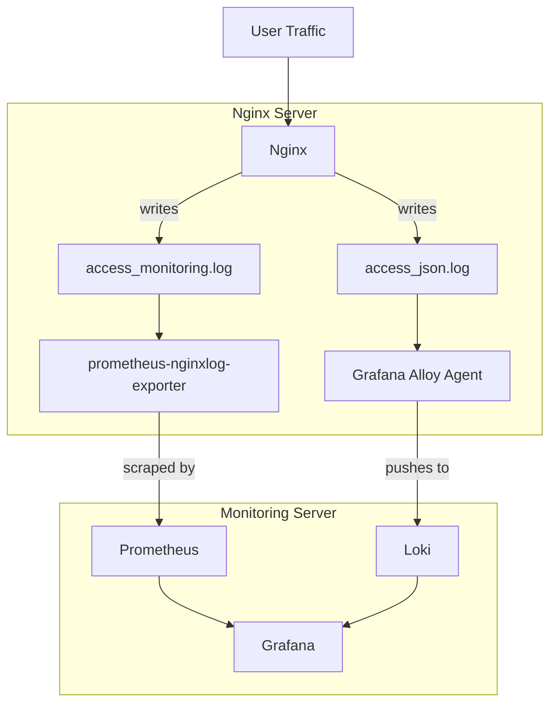

# 📘 Complete Guide: Nginx Monitoring for AIOps (Metrics + Logs)

คู่มือนี้เป็น **Best Practice** สำหรับการสร้างระบบ Monitoring Nginx แบบครบวงจร เพื่อรองรับงาน **AI Ops / Anomaly Detection / Root Cause Analysis** โดยแยกการทำงานเป็น 2 ส่วนสำคัญ:

1. **Metrics (Prometheus):** วัดประสิทธิภาพตัวเลข (RPS, Latency P95, Error Rate)
2. **Logs (Loki):** เก็บรายละเอียด Context, User, Path และ Error เชิงลึก

---

## ทำไมต้องระบบนี้? (Architecture & Value)

ระบบนี้ (Nginx + Prometheus + Loki + AIOps) เรียกว่า **"Full-Stack Observability Pipeline"** ครับ มันแก้ปัญหา Classic ของชาว DevOps ที่ว่า *"รู้ว่าเว็บล่ม แต่ไม่รู้ว่าทำไม"* หรือ *"รู้ตัวช้า ลูกค้าด่าก่อน"*

### 1. Metrics Pipeline (Nginx Exporter ➔ Prometheus)

**"ชีพจรของระบบ (The Pulse)"**

* **คืออะไร:** เป็นการแปลง Log ที่อ่านยากๆ ให้เป็น "ตัวเลขกราฟ" (Time Series)
* **ทำหน้าที่:** ตอบคำถามว่า **"เกิดอะไรขึ้น? (What)"** และ **"เมื่อไหร่? (When)"**
* เช่น: ตอนนี้มีคนเข้าเว็บกี่คน (RPS)? ตอนนี้เว็บช้าแค่ไหน (Latency)?

* **ทำไมต้องมี:**
* **เร็วและเบา:** ข้อมูลตัวเลขมีขนาดเล็กมาก เก็บย้อนหลังได้เป็นปีโดยไม่เปลือง Disk
* **เห็นภาพรวมทันที:** มองปราดเดียวรู้เลยว่าระบบปกติหรือป่วย ไม่ต้องมานั่งอ่าน Text ทีละบรรทัด

* **Value ต่อทีม:** ทีมจะรู้ตัวทันทีที่กราฟขยับผิดปกติ (Detection Time เร็วขึ้นมาก)

### 2. Logs Pipeline (Alloy ➔ Loki)

**"กล่องดำบันทึกเหตุการณ์ (The Black Box)"**

* **คืออะไร:** เป็นการเก็บรายละเอียดข้อความทุกอย่างที่เกิดขึ้นใน Request นั้นๆ (User IP, URL Path, Browser, Error Message)
* **ทำหน้าที่:** ตอบคำถามว่า **"ทำไมถึงเกิด? (Why)"** และ **"ใครเป็นคนทำ? (Who)"**
* เช่น: ที่กราฟแดงเมื่อกี้ เพราะ User ID 1234 ยิง API ผิด หรือเพราะ Database timeout?

* **ทำไมต้องมี:**
* **เก็บ Context:** Prometheus เก็บไม่ได้ว่า "User คนไหน Error" แต่ Loki เก็บได้
* **Searchable:** ค้นหาได้เหมือน Google (เช่น พิมพ์ `error` หรือ `ip="1.2.3.4"`) โดยไม่ต้อง SSH เข้า Server ไป `grep` ให้ตาลาย

* **Value ต่อทีม:** ลดเวลา Debug (Mean Time To Repair - MTTR) จากเป็นชั่วโมงเหลือไม่กี่นาที เพราะจิ้มเจอปัญหาได้เลย

### 3. AIOps Engine (Python + Prophet)

**"ผู้ช่วยอัจฉริยะ (The Intelligence)"**

* **คืออะไร:** โปรแกรม Python ที่ดึงข้อมูลจาก Prometheus มาให้ AI (Prophet) เรียนรู้พฤติกรรมในอดีต
* **ทำหน้าที่:** ตอบคำถามว่า **"สิ่งที่เกิดขึ้นนี้ ปกติไหม?"**
* **ทำไมต้องมี:**
* **Dynamic Threshold:** การตั้ง Alert แบบเดิมคือ "ถ้าเกิน 1 วินาที ให้เตือน" แต่จริงๆ แล้วตอนตี 3 เว็บอาจจะเร็วมาก (0.05s) ถ้าจู่ๆ ขึ้นมา 0.5s (ยังไม่ถึง 1s) AI จะเตือนคุณก่อนเลยว่า "ผิดปกตินะ"
* **ลด Noise:** AI เข้าใจช่วง Peak (เช่น วันหวยออก) ว่า Traffic เยอะเป็นเรื่องปกติ ไม่ต้องแจ้งเตือนพร่ำเพรื่อ

* **Value ต่อทีม:** เปลี่ยนทีมจากการทำงานแบบ **Reactive** (วัวหายล้อมคอก) เป็น **Proactive** (รู้ล่วงหน้าก่อนล่ม)

---

## 📌 Architecture Overview



---

## 🛠️ Part 0: Prerequisites (เตรียมเครื่อง Nginx)

ก่อนเริ่มตั้งค่า หากเครื่องยังไม่มี Nginx ให้ติดตั้งและตรวจสอบสถานะก่อน

```bash
# 1. Update & Install Nginx
sudo apt-get update
sudo apt-get install nginx -y

# 2. ตรวจสอบสถานะ
sudo systemctl status nginx

# 3. เปิดให้ทำงานอัตโนมัติเมื่อเปิดเครื่อง
sudo systemctl enable nginx
```

---

## 🏗️ Part 1: Nginx Configuration (The Foundation)

เราจะตั้งค่า Nginx ให้เขียน Log 2 แบบแยกกัน เพื่อประสิทธิภาพสูงสุด

### 1.1 ตั้งค่า Log Format

**ไฟล์:** `/etc/nginx/nginx.conf`
เพิ่มใน block `http {}`

```nginx
http {
    # 1. Format สำหรับ Metrics (Text file อ่านง่าย เร็ว)
    log_format monitoring '$remote_addr - $remote_user [$time_local] "$request" $status $body_bytes_sent "$http_referer" "$http_user_agent" "$request_time" "$uri"';

    # 2. Format สำหรับ Logs/AIOps (JSON เพื่อเก็บ Detail ครบ)
    log_format json_analytics escape=json '{'
        '"time":"$time_iso8601",'
        '"method":"$request_method",'
        '"uri":"$request_uri",'
        '"status":$status,'
        '"request_time":$request_time,'
        '"http_host":"$http_host",'
        '"upstream_addr":"$upstream_addr"'
        '"http_user_agent":"$http_user_agent",'
        '"http_referer":"$http_referer",'
    '}';

    include /etc/nginx/conf.d/*.conf;
}
```

### 1.2 เปิดใช้งาน Log ใน Server Block

**ไฟล์:** `/etc/nginx/conf.d/backend.conf` (หรือไฟล์ vhost ของคุณ)

```nginx
server {
    listen 443 ssl;
    server_name domain;

    # แยกไฟล์ Log เพื่อไม่ให้ตีกัน และจัดการง่าย
    access_log /var/log/nginx/access_monitoring.log monitoring;
    access_log /var/log/nginx/access_json.log json_analytics;
}
```

### 1.3 Apply Configuration (สำคัญ!)

หลังจากแก้ไฟล์ Config เสร็จแล้ว ต้องสั่งคำสั่งนี้ทุกครั้ง

```bash
# 1. เช็ค Syntax (ต้องขึ้น OK)
sudo nginx -t

# 2. Reload Config
sudo systemctl reload nginx

# 3. สร้าง Traffic จำลอง
curl http://localhost/test-page

# 4. เช็ค Log ด้วยตาเปล่า (ต้องเห็นข้อมูลไหลมา)
# แบบดูไฟล์ล่าสุด
tail -f /var/log/nginx/access_json.log

# หรือแบบดูหัวไฟล์
head -n 5 /var/log/nginx/access_monitoring.log
```

---

## 📊 Part 2: Metrics Pipeline (Prometheus + Exporter)

ส่วนนี้สำหรับดึงค่า RPS, Latency, Error Rate ไปทำกราฟและ Alert

### 2.1 ติดตั้ง Exporter

```bash
wget https://github.com/martin-helmich/prometheus-nginxlog-exporter/releases/download/v1.11.0/prometheus-nginxlog-exporter_1.11.0_linux_amd64.tar.gz
tar xvf prometheus-nginxlog-exporter_1.11.0_linux_amd64.tar.gz
sudo mv prometheus-nginxlog-exporter /usr/local/bin/
sudo chmod +x /usr/local/bin/prometheus-nginxlog-exporter
```

### 2.2 Config Exporter

**ไฟล์:** `/etc/prometheus-nginx-log-exporter.yaml`

```yaml
listen:
  port: 4040
  address: "0.0.0.0"

namespaces:
  - name: nginx
    format: '$remote_addr - $remote_user [$time_local] "$request" $status $body_bytes_sent "$http_referer" "$http_user_agent" "$request_time" "$path"'
    source:
      files:
        - /var/log/nginx/access_monitoring.log
    tags:
      - path
    histogram_buckets: [.005, .01, .025, .05, .1, .25, .5, 1, 2.5, 5, 10]
```

### 2.3 สร้าง Service และ Start

**ไฟล์:** `/etc/systemd/system/nginx-log-exporter.service`

```ini
[Unit]
Description=Nginx Log Exporter
After=network.target

[Service]
ExecStart=/usr/local/bin/prometheus-nginxlog-exporter -config-file /etc/prometheus-nginx-log-exporter.yaml
Restart=always

[Install]
WantedBy=multi-user.target
```

สั่งรัน:

```bash
# Start Service
sudo systemctl daemon-reload
sudo systemctl enable --now nginx-log-exporter

# ตรวจสอบ Log ของ Service
journalctl -u nginx-log-exporter -f

# ตรวจสอบผ่าน Web Browser
# เปิด URL: http://<SERVER_IP>:4040/metrics
# ต้องเห็น Text เรียงกัน เช่น: nginx_http_response_count_total 10
```

---

## 🪵 Part 3: Loki Server Setup (Monitoring Node)

ส่วนนี้คือการติดตั้ง **Loki** บนเครื่อง Monitoring Server เพื่อทำหน้าที่รับ Logs จาก Alloy และเก็บข้อมูลลง Disk

### 3.1 เตรียมโฟลเดอร์และกำหนดสิทธิ์

Loki ต้องการสิทธิ์ในการเขียนไฟล์ลง Disk (ใช้ User ID 10001)

```bash
# 1. สร้างโฟลเดอร์สำหรับ Config และ Data
sudo mkdir -p /opt/loki/config
sudo mkdir -p /opt/loki/data

# 2. กำหนดสิทธิ์ให้ Loki (UID 10001) เขียนไฟล์ได้
sudo chown -R 10001:10001 /opt/loki
sudo chmod -R 775 /opt/loki
```

### 3.2 สร้างไฟล์ Config Loki

**ไฟล์:** `/opt/loki/config/loki.yaml`

```yaml
auth_enabled: false

server:
  http_listen_port: 3100
  grpc_listen_port: 9096

common:
  instance_addr: 127.0.0.1
  path_prefix: /loki
  storage:
    filesystem:
      chunks_directory: /loki/chunks
      rules_directory: /loki/rules
  replication_factor: 1
  ring:
    kvstore:
      store: inmemory

schema_config:
  configs:
    - from: 2024-01-01
      store: tsdb
      object_store: filesystem
      schema: v13
      index:
        prefix: index_
        period: 24h

storage_config:
  filesystem:
    directory: /loki/chunks

limits_config:
  retention_period: 336h
  reject_old_samples: true
  reject_old_samples_max_age: 168h
  max_cache_freshness_per_query: 10m
  split_queries_by_interval: 15m
  allow_structured_metadata: true

compactor:
  working_directory: /loki/compactor
  retention_enabled: true
  delete_request_store: filesystem
  compaction_interval: 10m
  retention_delete_delay: 2h
  retention_delete_worker_count: 150

analytics:
  reporting_enabled: false
```

### 3.3 สร้าง Docker Compose สำหรับ Loki

**ไฟล์:** `/opt/loki/docker-compose.yml`

```yaml
version: "3.8"
services:
  loki:
    image: grafana/loki:latest
    container_name: loki
    ports:
      - "3100:3100"
    volumes:
      - /opt/loki/config/loki.yaml:/etc/loki/loki.yaml:ro
      - /opt/loki/data:/loki
    command: -config.file=/etc/loki/loki.yaml
    restart: unless-stopped
    user: "10001:10001" # บังคับรันด้วย UID ของ Loki เพื่อกันปัญหา Permission
    mem_limit: 1g
    cpus: "1.0"
    healthcheck:
      test: ["CMD-SHELL", "wget --no-verbose --tries=1 --spider http://localhost:3100/ready || exit 1"]
      interval: 10s
      timeout: 5s
      retries: 5
```

### 3.4 สั่งรัน Loki

```bash
cd /opt/loki
docker-compose up -d

# ตรวจสอบว่า Container ทำงานปกติ (สถานะต้องเป็น Up (healthy))
docker ps | grep loki

# ตรวจสอบ Logs ถ้ามี Error
docker logs -f loki
```

---

## 🪵 Part 4: Logs Pipeline (Loki + Alloy)

ส่วนนี้ใช้ **Docker Compose** เพื่อรัน Alloy Agent สำหรับส่ง Logs ไปยัง Loki

### 4.1 สร้างไฟล์ Config Alloy

**ไฟล์:** `/opt/alloy/config/alloy.hcl`

```hcl
local.file_match "nginx_json" {
  path_targets = [
    {
      __path__ = "/var/log/nginx/access_json.log",
      job      = "nginx-json",
      host     = "nginx-01",
    },
  ]
}

loki.source.file "nginx_json" {
  targets    = local.file_match.nginx_json.targets
  forward_to = [loki.process.nginx_json.receiver]
}

loki.process "nginx_json" {

  stage.json {
    expressions = {
      time            = "time",
      method          = "method",
      status          = "status",
      request_time    = "request_time",
      http_host       = "http_host",
      uri_var         = "request_uri", 
      uri_custom      = "uri",         
    }
  }

  stage.template {
    source   = "real_uri"
    template = "{{ if .uri_custom }}{{ .uri_custom }}{{ else }}{{ .uri_var }}{{ end }}"
  }

  stage.replace {
    source     = "real_uri"
    expression = "/[0-9a-fA-F]{8,}" 
    replace    = "/:hash"
  }

  stage.replace {
    source     = "real_uri"
    expression = "/[0-9]+" 
    replace    = "/:id"
  }

  stage.labels {
    values = {
      path_norm = "real_uri", 
      method    = "method",
      http_host = "http_host",
    }
  }
  
  stage.regex {
    source     = "status"
    expression = "^(?P<status_class>[0-9])"
  }
  stage.labels {
    values = { status_class = "status_class" }
  }

  stage.drop {
      source     = "real_uri"
      expression = "^/_next/|^/images/|\\.css$|\\.js$|\\.png$|\\.svg$"
  }

  forward_to = [loki.write.remote.receiver]
}

loki.write "remote" {
  endpoint {
    url = "http://<LOKI_IP>:3100/loki/api/v1/push"
  }
}
```

### 4.2 สร้าง Docker Compose

**ไฟล์:** `/opt/alloy/docker-compose.yml`

```yaml
version: "3.8"
services:
  alloy:
    image: grafana/alloy:latest
    container_name: alloy
    # เพิ่ม --server.http.listen-addr เพื่อให้ Debug ผ่าน Web UI ได้
    command: run --server.http.listen-addr=0.0.0.0:12345 /etc/alloy/alloy.hcl
    volumes:
      - /opt/alloy/config/alloy.hcl:/etc/alloy/alloy.hcl:ro
      - /var/log/nginx:/var/log/nginx:ro
    ports:
      - "12345:12345" # Alloy UI Status
    restart: unless-stopped
    mem_limit: 512m
    cpus: "0.5"
    network_mode: "host" # แนะนำ: ใช้ host mode เพื่อประสิทธิภาพสูงสุดในการส่ง Log
```

### 4.3 สั่งรัน Alloy

```bash
cd /opt/alloy
docker-compose up -d

# ตรวจสอบ Logs
docker logs -f alloy
```

---

## 📈 Part 5: Dashboard Creation (Step-by-Step)

ขั้นตอนนี้คือการสร้าง Dashboard ใน Grafana เพื่อแสดงผลข้อมูล AIOps

### 🔧 5.1 ตั้งค่า Variables (ตัวแปร)

ไปที่ **Settings** > **Variables**

1. **Variable: `path**`
* Query: `label_values({job="nginx-json"}, path_norm)`
* Multi-value: ✅ On, Include All: ✅ On


2. **Variable: `search**`
* Type: Text box


### 🐢 5.2 Panel: P95 Latency by Path

* **Vis:** Time Series
* **Query:**

```logql
quantile_over_time(0.95,
  {job="nginx-json", path_norm=~"$path"}
  |= "$search" | json | __error__="" | unwrap request_time [5m]
) by (path_norm)
```


### 🚨 5.3 Panel: Error Rate (Top Errors)

* **Vis:** Time Series
* **Query:**
  
```logql
sum by (path_norm) (
  count_over_time({job="nginx-json", status_class="5", path_norm=~"$path"} |= "$search" [1m])
)
```


### 📝 5.4 Panel: Logs Stream (ตารางสีสวยงาม)

* **Vis:** **Table** (สำคัญ!)
* **Query Options:** Type=`Range`, **Line limit=`500**`
* **Query:**

```logql
{job="nginx-json", path_norm=~"$path"} |= "$search" | json | __error__=""
```

* **Transformations:**
1. **Extract fields:** Source=`Line`, Format=`JSON`, Replace=✅
2. **Organize fields:** เลือกเฉพาะ Time, Method, Path, Status, Latency
3. **Convert field type:** Status -> Number

* **Overrides:** ใส่สีช่อง Status (Thresholds: Absolute)

### 📊 5.5 Panel: Total Summary (ตารางสรุปยอด)

* **Vis:** **Table**
* **Query Options:** **Type=`Instant**` ⚠️ (ห้ามลืม)
* **Query:**
```logql
sum by (method, path_norm, status) (
  count_over_time({job="nginx-json"} |= "$search" | json | __error__="" [$__range])
)
```

* **Transformations:**
1. **Labels to fields:** เพื่อแตกคอลัมน์ออกมา
2. **Organize fields:** เปลี่ยนชื่อ Value เป็น Count

---

## 🔄 Part 6: Log Rotation (สำคัญมาก ห้ามลืม!)

เนื่องจากเราสั่งให้ Nginx เขียน Log เพิ่มอีก 2 ไฟล์ (`access_monitoring.log`, `access_json.log`) เราต้องตั้งค่าให้ระบบหมุนเวียนไฟล์เก่าทิ้งและบีบอัดไฟล์เพื่อประหยัดพื้นที่ Disk

### 6.1 แก้ไข Config Logrotate

ปกติ Nginx จะมี Config เดิมอยู่ที่ `/etc/logrotate.d/nginx` ให้เราเข้าไปแก้ไขเพื่อให้ครอบคลุมไฟล์ใหม่ครับ

**ไฟล์:** `/etc/logrotate.d/nginx`

```nginx
/var/log/nginx/*.log {
    daily                 # หมุนไฟล์ทุกวัน
    missingok             # ถ้าไฟล์หาไม่เจอไม่ต้อง Error
    rotate 14             # เก็บย้อนหลัง 14 วัน (ปรับได้ตาม Policy)
    compress              # บีบอัดเป็น .gz เพื่อประหยัดพื้นที่
    delaycompress         # ไฟล์เมื่อวานยังไม่ต้องรีบบีบ (เผื่อมี Process อื่นอ่านอยู่)
    notifempty            # ถ้าไฟล์ว่างเปล่า ไม่ต้องหมุน
    create 0640 www-data adm
    sharedscripts
    prerotate
        if [ -d /etc/logrotate.d/httpd-prerotate ]; then \
            run-parts /etc/logrotate.d/httpd-prerotate; \
        fi \
    endscript
    postrotate
        # สำคัญที่สุด! สั่งให้ Nginx ตัดไฟล์แล้วเริ่มเขียนไฟล์ใหม่
        invoke-rc.d nginx rotate >/dev/null 2>&1
    endscript
}
```

> **จุดสังเกต:** บรรทัดแรก `/var/log/nginx/*.log` จะใช้ Wildcard `*` เพื่อให้ครอบคลุมทั้ง `access_monitoring.log` และ `access_json.log` โดยอัตโนมัติครับ

### 6.2 ทดสอบการทำงาน (Dry Run)

เมื่อแก้เสร็จแล้ว **ต้องทดสอบ** ว่า Config ถูกต้องและมองเห็นไฟล์ใหม่ของเราไหม

```bash
# สั่ง Test แบบไม่ต้องทำจริง (Debug mode)
sudo logrotate -d /etc/logrotate.d/nginx
```

**สิ่งที่ต้องเช็คใน Output:**

1. ต้องเห็นชื่อไฟล์ `access_monitoring.log` และ `access_json.log` ปรากฏอยู่ในรายการ
2. ต้องไม่ขึ้น Error ว่า Permission Denied หรือ Syntax Error

### 6.3 การบังคับ Rotate ทันที (Optional)

ถ้าอยากให้มันตัดไฟล์เดี๋ยวนี้เลย (เช่น ไฟล์เริ่มใหญ่เกินไปแล้ว)

```bash
sudo logrotate -f /etc/logrotate.d/nginx
```

---

## 🔮 Part 7: AIOps Use Cases

เมื่อระบบเสร็จสมบูรณ์ คุณสามารถนำข้อมูลไปใช้ดังนี้:

1. **Anomaly Detection:** ใช้ Prometheus AlertManager แจ้งเตือนเมื่อ P95 Latency สูงเกิน Baseline
2. **Root Cause Analysis:** เมื่อกราฟแดง ให้เลื่อนลงมาดูตาราง Logs Stream แล้ว Filter หา Error Code หรือ User ID ที่มีปัญหา
3. **Capacity Planning:** ดูตาราง Total Summary เพื่อดูว่า API Path ไหนถูกเรียกเยอะสุด และ Response Time เฉลี่ยเป็นเท่าไหร่

---

## 🚀 Part 8: Future Roadmap (สิ่งที่ DevOps ทำต่อได้)

เมื่อระบบพื้นฐาน (Foundation) เสร็จแล้ว คุณสามารถ "ต่อยอด" เพื่อสร้าง Value ให้กับธุรกิจและความปลอดภัยได้อีกมหาศาลครับ

### 1. ยกระดับ Dashboard (Business Visibility)

เปลี่ยนมุมมองจาก "Server Health" เป็น "Business Health" เพื่อให้คนที่ไม่ใช่ Tech ดูรู้เรื่อง

* **สิ่งที่ทำได้:**
* ดึง Status Code `200` จาก Path `/api/order/confirm` มาพล็อตเป็นกราฟ **"ยอดขาย Real-time"**
* เทียบกราฟ Traffic **"วันนี้ vs สัปดาห์ที่แล้ว"** เพื่อดูแนวโน้มการเติบโต

* **ประโยชน์:** Management จะรัก Dashboard นี้มาก เพราะมันคือเงินทองของบริษัท

### 2. เพิ่มความปลอดภัย (Security Monitoring / DevSecOps)

เปลี่ยน Logs ให้เป็นระบบกันขโมย (SIEM - Security Information and Event Management)

* **สิ่งที่ทำได้:**
* เขียน LogQL Alert จับ **Brute Force:** "ถ้า IP ไหนยิง Login ผิด (401) เกิน 10 ครั้งใน 1 นาที ให้แจ้งเตือน"
* จับ **SQL Injection:** "ถ้า URL มีคำว่า `union select`, `DROP TABLE` ให้แจ้งเตือนทันที"
* จับ **Bot:** "ถ้า User Agent เป็นค่าว่าง หรือดูแปลกๆ ให้แจ้งเตือน"

* **ประโยชน์:** ป้องกันการโจมตีก่อนที่จะเสียหายจริง

### 3. เชื่อมต่อกับ Application Log (Distributed Tracing)

เชื่อมโยง Nginx เข้ากับ Backend (Java/Node.js/Go) เพื่อเห็นภาพครบ Flow

* **สิ่งที่ทำได้:**
* ให้ Nginx สร้าง `Request-ID` (X-Request-ID) แล้วส่งไปให้ Backend
* ให้ Alloy อ่าน Log ของ Backend ด้วย
* ใน Grafana Dashboard สามารถเอา ID ไปค้นทีเดียว เห็นเลยว่า:
`Browser -> Nginx (ช้าไหม?) -> App (ช้าไหม?) -> Database (ช้าไหม?)`

* **ประโยชน์:** จบปัญหาการเกี่ยงงานระหว่างทีม Infra กับทีม Dev ว่า "ตกลงช้าที่ใคร"

### 4. Self-Healing (ระบบรักษาตัวเอง)

ขั้นสุดของ DevOps คือการให้ระบบแก้ปัญหาเอง (Automation)

* **สิ่งที่ทำได้:**
* เมื่อ Python AIOps เจอว่า "Nginx Error Rate พุ่งสูง"
* แทนที่จะแค่ส่ง Discord -> ให้ Python ยิงคำสั่งไปที่ Kubernetes หรือ Ansible เพื่อ **Restart Pod/Service** นั้นทันที
* หรือถ้า Disk จะเต็ม -> สั่งลบ Log เก่าทิ้งอัตโนมัติ

* **ประโยชน์:** คุณจะได้นอนหลับเต็มอิ่ม ไม่ต้องตื่นมา Restart Server กลางดึกครับ

---
